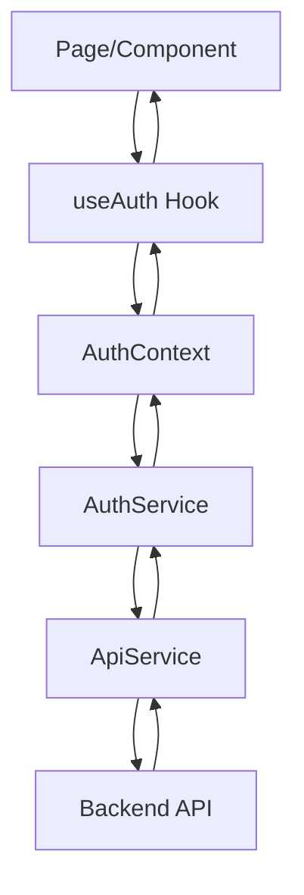

# Architecture Frontend - Template Next.js + Supabase + FastAPI

Ce template propose une architecture frontend modulaire et professionnelle, conçue pour être facilement extensible et maintenable.

## 🏗️ Architecture

### Structure des dossiers

```
src/
├── app/                     # Pages Next.js App Router
│   ├── dashboard/           # Page tableau de bord (protégée)
│   ├── login/               # Page de connexion/inscription  
│   ├── layout.tsx           # Layout principal avec AuthProvider
│   └── page.tsx            # Page d'accueil
├── components/              # Composants réutilisables
│   ├── guards/              # Protection des routes
│   │   ├── AuthGuard.tsx    # Composant de protection
│   │   └── withAuth.tsx     # HOC de protection
│   └── ui/                  # Composants d'interface
│       ├── LoadingSpinner.tsx
│       ├── UserProfileCard.tsx
│       └── ErrorMessage.tsx
├── lib/                     # Bibliothèques et utilitaires
│   ├── contexts/            # Contexts React
│   │   └── AuthContext.tsx  # Context d'authentification
│   ├── hooks/               # Hooks personnalisés
│   │   └── useAuth.ts       # Hook d'authentification
│   └── config.ts           # Configuration centralisée
├── services/                # Services API
│   ├── api.ts              # Service API générique
│   └── auth.ts             # Service d'authentification
└── types/                   # Types TypeScript
    ├── auth.ts             # Types d'authentification
    ├── api.ts              # Types API
    └── index.ts            # Export central
```

## 🔧 Composants principaux

### 1. AuthProvider & useAuth

**Emplacement** : `src/lib/contexts/AuthContext.tsx` & `src/lib/hooks/useAuth.ts`

Le système d'authentification centralisé qui gère :
- État global de l'utilisateur
- Connexion/déconnexion
- Gestion des erreurs
- Persistance du token

**Utilisation** :
```tsx
const { user, profile, isAuthenticated, login, logout, error } = useAuth();
```

### 2. Services API

**Emplacement** : `src/services/`

Services encapsulant tous les appels API :
- `ApiService` : Service générique avec gestion des erreurs
- `AuthService` : Service spécialisé pour l'authentification

**Utilisation** :
```tsx
import { authService } from '@/services';

// Connexion
const response = await authService.login({ email, password });

// Récupération du profil
const profile = await authService.getUserProfile();
```

### 3. Protection des routes

**Emplacement** : `src/components/guards/`

Deux approches pour protéger les routes :

**AuthGuard (Composant)** :
```tsx
<AuthGuard>
  <PrivateContent />
</AuthGuard>
```

**withAuth (HOC)** :
```tsx
const ProtectedPage = withAuth(MyPage);
```

### 4. Composants UI réutilisables

**Emplacement** : `src/components/ui/`

- `LoadingSpinner` : Indicateur de chargement configurable
- `UserProfileCard` : Affichage du profil utilisateur
- `ErrorMessage` : Affichage d'erreurs avec style

## 🚀 Comment utiliser ce template

### 1. Ajouter une nouvelle page protégée

```tsx
// src/app/nouvelle-page/page.tsx
'use client';

import { AuthGuard } from '@/components';
import { useAuth } from '@/lib/hooks';

export default function NouvellePage() {
  const { profile } = useAuth();
  
  return (
    <AuthGuard>
      <div>
        <h1>Page protégée pour {profile?.full_name}</h1>
      </div>
    </AuthGuard>
  );
}
```

### 2. Ajouter un nouveau service API

```tsx
// src/services/monService.ts
import { apiService } from './api';

export class MonService {
  async getData() {
    return apiService.get('/mon-endpoint');
  }
  
  async postData(data: any) {
    return apiService.post('/mon-endpoint', data);
  }
}

export const monService = new MonService();
```

### 3. Créer un nouveau hook personnalisé

```tsx
// src/lib/hooks/useMonHook.ts
'use client';

import { useState, useEffect } from 'react';
import { monService } from '@/services';

export const useMonHook = () => {
  const [data, setData] = useState(null);
  const [loading, setLoading] = useState(true);
  
  useEffect(() => {
    const fetchData = async () => {
      try {
        const result = await monService.getData();
        setData(result);
      } catch (error) {
        console.error(error);
      } finally {
        setLoading(false);
      }
    };
    
    fetchData();
  }, []);
  
  return { data, loading };
};
```

### 4. Ajouter un nouveau composant UI

```tsx
// src/components/ui/MonComposant.tsx
import { ComponentProps } from '@/types';

interface MonComposantProps extends ComponentProps {
  title: string;
  description?: string;
}

export const MonComposant: React.FC<MonComposantProps> = ({
  title,
  description,
  className = '',
  children
}) => {
  return (
    <div className={`mon-composant ${className}`}>
      <h2>{title}</h2>
      {description && <p>{description}</p>}
      {children}
    </div>
  );
};

// N'oubliez pas de l'exporter dans src/components/ui/index.ts
```

## 📝 Bonnes pratiques

### 1. Gestion des erreurs
- Utilisez les services pour encapsuler la logique API
- Les erreurs sont automatiquement gérées par `ApiService`
- Affichez les erreurs avec le composant `ErrorMessage`

### 2. Types TypeScript
- Tous les types sont centralisés dans `src/types/`
- Utilisez `ComponentProps` pour les props de base des composants
- Étendez les interfaces existantes plutôt que de les recréer

### 3. État global
- Utilisez `useAuth` pour l'authentification
- Créez de nouveaux contexts pour d'autres états globaux
- Évitez la duplication d'état entre composants

### 4. Composants
- Privilégiez la composition à l'héritage
- Utilisez des props pour rendre les composants configurables
- Séparez la logique métier de l'affichage

### 5. Services
- Un service par domaine métier (auth, users, products, etc.)
- Utilisez des classes avec des méthodes publiques
- Exportez des instances singleton

## 🔄 Flux de données



## 🛡️ Sécurité

- Les tokens sont automatiquement inclus dans les headers
- Les routes protégées redirigent automatiquement vers login
- Les erreurs 401 déconnectent automatiquement l'utilisateur
- Validation côté client ET serveur

## 📚 Ressources

- **Next.js 14** : https://nextjs.org/docs
- **React Context** : https://react.dev/reference/react/createContext
- **TypeScript** : https://www.typescriptlang.org/docs
- **Tailwind CSS** : https://tailwindcss.com/docs

---

Cette architecture fournit une base solide et extensible pour développer des applications React modernes avec une authentification robuste et une structure de code maintenable.